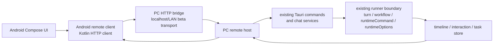

# Android Remote Control

> 状态：当前实现边界文档，记录 `v1.0-beta` Android remote experimental 能力和后续稳定化边界。
> 核对时间：2026-06-25。

## Product Boundary

Android 版 Lilia 是远端控制面，不是桌面端运行核心的移动移植。

`v1.0-beta` 当前目标是让用户在竖屏手机上连接一台 PC，查看任务和会话状态，继续聊天，处理 AskUser / 权限审批，并对正在运行的任务做中断、重试等关键操作。Android 端不内置 agent runner、Node.js、Claude / Codex provider adapter、Tauri desktop backend 或本地执行能力。

所有会导致 agent 执行、文件访问、终端操作、provider 设置读取或权限变更的操作都必须发送到当前 active PC，由 PC 端沿用既有 Lilia runner、timeline、pending turn、permission 和 interaction 路径处理。PC 是项目、任务、会话、timeline、interaction、provider 状态和持久化的唯一权威源。

`v1.0-beta` 明确不做：

- Android 本地运行 Claude / Codex 或任何 provider adapter。
- Android 在多台 PC 之间路由请求。
- PC 之间同步任务、会话或 timeline。
- PC A 代理 Android 请求到 PC B。
- 离线操作队列和冲突合并。
- 完整桌面设置页、自动化编辑器、复杂文件管理或桌面布局复刻。

Android 可以绑定多台 PC，但同一时间只有一个 active PC。用户切换 active PC 后，后续请求只发往新的 active PC。

## Current Architecture

当前 beta 技术栈是 `Jetpack Compose + PC HTTP bridge`。它证明跨端远控链路，但不承诺最终传输层；iroh / shared remote crate 留给后续稳定化。



Android 端职责：

- 管理移动端 UI、扫码配对、active PC 切换、前后台生命周期和系统通知入口。
- 保存 Android endpoint id、已信任 PC 记录、最近 active PC 和轻量只读缓存。
- 发送 typed remote request，读取 PC 返回的权威快照。
- 渲染任务收件箱、任务详情、timeline、composer、AskUser 和权限审批。

PC 端职责：

- 暴露 beta HTTP bridge 和 remote host dispatch。
- 生成一次性配对二维码，保存已信任 Android 设备。
- 校验远端设备身份和协议版本。
- 把 Android request 映射到现有 Lilia 命令、任务服务和 runner 边界。
- 把任务、timeline、interaction、provider 状态和执行结果返回给 Android。

HTTP bridge 是 beta 传输层，适合当前本地网络和发布验证闭环。后续迁移到 iroh 时，不能改变 PC 端权威源和 existing runner 边界。

参考：

- https://docs.iroh.computer/languages/kotlin
- https://docs.iroh.computer/languages
- https://docs.rs/iroh/latest/iroh/

## Stack Decision

当前 `v1.0-beta` 选择 `Compose + PC HTTP bridge`，把 Android 原生能力放在 Kotlin 层，同时避免在 beta 阶段承担 NDK / FFI / relay / 跨端连接状态机复杂度。

候选 2 是 `Compose + iroh Kotlin/FFI`。它适合加密连接、endpoint 身份和 relay / direct connectivity，但会引入 Android 绑定、生命周期和高频 timeline 同步成本。

候选 3 是 `Compose + Rust shared remote crate + FFI`。长期一致性最好，也最适合 PC-PC 和复杂多节点协议，但工程成本最高。

迁移触发条件：

- PC-PC 互联进入近期实现。
- 远控协议出现复杂多节点路由、连接转发或跨 PC 发现。
- Android 和 PC 侧开始重复维护同一套连接状态机。
- HTTP bridge 在安全边界、网络发现、断线恢复或高频 timeline 同步上不足以支撑稳定远控。

## Pairing And Trust

`v1.0-beta` 使用 PC 展示二维码、Android 扫码配对。

配对流程：

1. PC 端用户打开远控配对入口，生成一次性 pairing ticket，并显示二维码。
2. pairing ticket 包含 PC endpoint 地址信息、PC 设备标识、协议版本、过期时间和一次性 challenge。
3. Android 扫码后通过 pairing URI 中的 bridge URL 提交 Android endpoint id、设备名称和 challenge response。
4. PC 端确认 challenge 有效后写入 trusted device record。
5. Android 写入 PC trust record，并把该 PC 加入 saved PC 列表。

LiliaRemote 与 LiliaVoice 共用同一个配对协议：PC 端只生成 `lilia-remote://pair?...` 票据，Android `remote-core` 同时接受 `lilia-remote://pair` 和 `lilia-voice://pair`，并统一落到 `RemotePairingTicket`、`/pair` 请求和 trusted device 记录。

持久化内容：

- Android 保存自己的 endpoint id，用于保持稳定设备身份。
- Android 保存每台 PC 的 endpoint id、显示名称、最近连接时间、协议版本和 trust metadata。
- PC 保存每台 Android 设备的 endpoint id、显示名称、首次配对时间、最近连接时间和授权状态。

配对成功后，Android 默认获得完整远控权限。完整远控表示 Android 可以请求 PC 展示项目、任务、会话、timeline、provider 状态，并可发起现有 Lilia 操作。它不表示绕过权限：危险命令、工具审批、AskUser、权限提升和 provider 交互仍由 PC 端既有规则决定，并通过 event stream 推送到 Android 渲染。

重连模型：

- Android 回到前台时使用持久化 endpoint secret 重新 bind，并自动连接最近 active PC。
- PC 端根据 trusted device record 接受重连，不要求重新扫码。
- 若 trust record 被 PC 撤销，Android 必须清除该 PC 的 active 状态并提示重新配对。
- v1 不引入单独 session token 续期。后续如需要更强安全边界，可在长期 trust record 之上增加短期 session token。

## Remote Protocol

远控协议采用 typed request / response。`packages/contracts/src/remote-control.ts` 定义 request / response / event 形状；`packages/contracts/src/remote-control-command-contract.json` 只保存 Tauri IPC 命令名。

Android 不直接构造 provider 专属 payload，不直接绕过 runner，也不把移动端行为塞进 `ChatWorkflow`。现有 agent 边界仍然是：

```ts
{
  turn,
  workflow,
  runtimeCommand,
  runtimeOptions
}
```

Android 只是远端发起方。PC remote host 负责把 remote request 映射到现有 Tauri command、task service、chat service 或 runner invocation。

远控 contract 已扩展 `packages/contracts`，当前至少覆盖：

- `RemotePeerSummary`：已绑定 PC / Android 设备摘要。
- `RemotePairingTicket`：PC 生成的一次性配对票据。
- `RemoteRequestEnvelope`：Android 发往 PC 的 typed request。
- `RemoteResponseEnvelope`：PC 对 request 的成功、错误或 unsupported 响应。
- `RemoteEventEnvelope`：后续 push-style event stream 的 task / timeline / interaction / provider / connection 事件形状。
- `RemoteCapabilitySet`：PC 暴露的远控能力、协议版本和兼容降级信息。

request 类型按 Lilia 语义分组，而不是按 Android 页面分组：

- connection：握手、能力读取、active session 恢复。
- tasks：读取任务收件箱、任务详情、任务状态。
- chat：发送普通 turn、发送 workflow、发送 runtime command、中断、重试。
- timeline：订阅任务 timeline、补拉最近快照。
- interaction：读取 pending AskUser / permission approval，提交用户选择。
- provider：读取 active backend、provider readiness 和账号 / app-server 状态摘要。

后续稳定 event stream 应支持：

- 连接状态变更。
- 任务列表增量更新。
- task detail snapshot 更新。
- timeline event 或 timeline batch。
- AskUser / permission approval / attestation 等 pending interaction。
- runner lifecycle、done、error、interrupt 和 retry result。
- provider 状态变化。

错误语义必须区分：

- unauthenticated：设备未配对或 trust record 不存在。
- unauthorized：设备已配对但权限不足或被撤销。
- unsupported：PC 端协议版本或 provider 不支持该能力。
- conflict：任务正在运行、turn 被重置或请求状态过期。
- unavailable：PC runner、provider、Node、Codex app-server 或项目路径不可用。
- transportClosed：iroh 连接断开，Android 可重连后刷新权威状态。

Android 端只允许轻量只读缓存：

- saved PC 列表和最近 active PC。
- 最近任务收件箱快照。
- 最近打开任务的 timeline 快照。
- 最近 pending interaction 摘要。

缓存只用于快速恢复 UI。Android 重新连接后必须从 PC 拉取权威快照，并以 PC 数据覆盖本地缓存。v1 不允许缓存未发送操作队列，也不允许离线继续编辑任务状态。

## Mobile Interaction Model

Android 不是桌面布局缩小版。竖屏端按远控任务流重构。

首屏是 active PC 的任务收件箱：

- 顶部显示当前 PC、连接状态和紧凑 PC 切换器。
- 主体展示任务 / 会话列表，优先显示运行中、等待用户处理、最近活跃和失败任务。
- 待处理 AskUser / 权限审批应在列表中有明确状态，不要求用户进入桌面式侧栏。
- 未连接时首屏转为连接状态和重新连接入口。

任务详情页以聊天和 timeline 为主体：

- timeline 占据主要阅读空间。
- composer 固定底部，适配单手输入和语音 / 系统分享入口的后续扩展。
- AskUser、权限审批和危险操作确认以内联卡片靠近 composer。
- 中断、重试、继续、切换 backend 等操作放在任务页顶部或 composer 附近，避免隐藏到桌面式侧栏。
- 长日志、工具调用和 process 细节默认折叠，先展示当前状态和最终回复。

多 PC 切换：

- 顶部紧凑切换器只改变 active PC。
- 切换 PC 后，任务收件箱和任务详情必须从新 active PC 刷新。
- 如果当前任务不属于新 active PC，Android 回到新 PC 的任务收件箱。
- v1 不展示跨 PC 聚合任务流，避免暗示多 PC 路由或同步已经存在。

## Implementation Notes

PC remote host 应作为桌面端后端能力接入，不作为 provider adapter 能力接入。它服务的是 Lilia 远控客户端，而不是 Claude / Codex provider。

协议实现时要保持这些边界：

- 远控 request 不能扩大 `ChatWorkflow` 的职责。
- session、settings、remote environment、sandbox diagnostics 等控制行为仍走 `ChatRuntimeCommand`。
- provider 专属字段仍进入 `ProviderRuntimeOptions.provider` 或 `experimentalProviderOptions`。
- PC 端收到 Android request 后，应尽量复用现有服务函数和 Tauri command 内部逻辑，而不是复制 runner 启动、timeline 持久化或 permission 处理。
- Android UI 不读取 providerContext 内部字段，只做 round-trip。

## Current Beta Implementation

Android beta 已建立 `apps/android` 原生工程，不把桌面 Tauri / Vue 壳迁移到移动端。

当前已经超过空壳阶段，实际链路包括：

- `packages/contracts/src/remote-control.ts` 定义协议版本、能力、request / response / event 类型。
- `packages/contracts/src/remote-control-command-contract.json` 定义 PC 端 Tauri IPC 命令名。
- PC 端 `remote_control.rs` 提供 HTTP bridge、配对、trusted device、dispatch、任务 / timeline / interaction / provider 查询和关键远控操作。
- Android 端实现 LiliaRemote Compose 壳、扫码配对、saved PC、active PC、任务收件箱、任务详情、timeline、composer、pending interaction 和关键远控操作；LiliaVoice 复用同一套 `remote-core` 配对和 saved PC 能力。
- `package.json` 提供 `yarn android:verify`，串联 doctor、smoke lib、unit test、debug / release APK 和 APK inspect。

当前仍不应承诺为稳定完整远控产品：

- HTTP bridge 仍是 beta 传输层。
- timeline subscribe 当前以快照 / 轮询更新为主，push-style event stream 仍需稳定化。
- Android companion 发布前必须有当前构建的 `yarn android:verify` 记录。
- Android 不提供本地 agent runner、离线操作队列、多 PC 聚合、PC-PC 路由或完整桌面设置面。

验证应覆盖：

- 未配对设备不能连接。
- 已撤销设备不能重连。
- Android 发送普通 turn 后，PC 端沿用既有 runner 和 timeline。
- Android 处理 AskUser / 权限审批后，PC 端 interaction 状态正确推进。
- Android 切换 active PC 后不会向旧 PC 发送后续操作。
- 断线重连后 Android 以 PC 快照覆盖本地缓存。
- 高频 timeline batch 不造成 UI 卡顿或连接背压。
