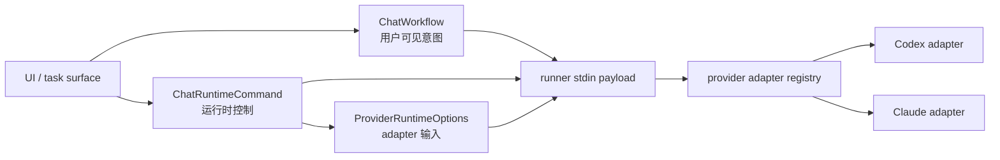

# Lilia Agent 三层协议

> 状态：本文是 Lilia 应用层到 Claude / Codex provider adapter 的协议边界文档。
> 核对时间：2026-06-14。

## 协议分层

Lilia 不再把所有 agent 行为都塞进 `ChatWorkflow`。当前协议分为三层：



`ChatWorkflow` 表达用户在 Lilia 里可见、可解释、可持久化的 agent 意图。`ChatRuntimeCommand` 表达会话、设置和未来 realtime / remote / process / file-search 这类运行时控制面。`ProviderRuntimeOptions` 只允许 runner 到 provider adapter 内部消费，不能作为 UI workflow。

## 输入形状

runner stdin 的稳定形状是：

```ts
{
  turn: {
    cwd: string;
    prompt: string;
    attachments: ChatAttachment[];
    model: string;
    resumeSessionId?: string | null;
    planMode: boolean;
    permission: PermissionMode;
  };
  workflow?: ChatWorkflow | null;
  runtimeCommand?: ChatRuntimeCommand | null;
  runtimeOptions?: ProviderRuntimeOptions | null;
}
```

旧输入 `lilia_session_fork`、`lilia_session_management`、`lilia_provider_settings` 不再作为 `workflow` 接收。调用方必须发送 `runtimeCommand`，provider 字段必须进入 `runtimeOptions.provider`。

## ChatWorkflow

`ChatWorkflow` 只保留用户可见工作流：

| workflow | 含义 | 空 prompt |
|---|---|---|
| `lilia_review` | 对指定代码范围做审查。 | 支持 |
| `lilia_fix_suggestion` | 生成修复建议或按模式应用修复。 | 支持 |
| `lilia_batch_apply` | 批量应用 review / fix suggestion 的结果。 | 支持 |
| `lilia_goal` | 设置、刷新或清除当前线程目标。 | 支持 |
| `lilia_compact` | 压缩当前 provider 会话上下文。 | 支持 |
| `lilia_background_terminals_clean` | 清理当前会话相关后台终端。 | 支持 |
| `lilia_memory_mode` | 启用或关闭 provider 记忆模式。 | 支持 |
| `lilia_memory_reset` | 重置 provider 记忆。 | 支持 |
| `lilia_config_diagnostics` | 读取 provider 配置和要求的诊断摘要。 | 支持 |
| `automation` | 自动化触发 agent turn。 | 支持 |
| `slash_command` | 执行 Lilia native / project slash command。 | 支持 |

空 prompt 规则来自 `packages/contracts/src/lilia-agent-protocol.json` 中按 kind 声明的 `requiresPrompt`。不要再新增散落字符串集合维护空 prompt workflow。

## ChatRuntimeCommand

`ChatRuntimeCommand` 是运行时控制入口：

| runtime command | 含义 | provider 映射 |
|---|---|---|
| `lilia_session_fork` | 从当前 provider session 分叉新 session。 | Codex 使用 thread fork；Claude 使用 session resume / transcript 能力时由 adapter 映射或 diagnostic。 |
| `lilia_session_management` | list / info / messages / rename / tag / delete / archive 等 provider session 管理。 | Codex 接 thread list / search / turns / archive / name set；Claude 接 SDK session APIs。 |
| `lilia_provider_settings` | diagnose / update provider runtime 设置。 | 设置值必须进入顶层 `runtimeOptions.common` / `runtimeOptions.provider`；Claude 写本地诊断并把 update 映射到 SDK query options，Codex 写本地诊断并把 update 映射到 `thread/settings/update`。 |

预留 runtime command 边界包括 realtime、remote environment、process session、file search session。接入这些能力时必须新增 runtime command 或 experimental capability，不得扩大 `ChatWorkflow` union。

## ProviderRuntimeOptions

`ProviderRuntimeOptions.common` 只保存稳定 Lilia 字段：

| 字段 | 含义 |
|---|---|
| `model` | 模型选择。 |
| `permission` | Lilia 权限模式。 |
| `reasoningEffort` | 通用 reasoning / effort 意图。 |
| `runtimeWorkspaceRoots` | 运行时工作区根目录。 |

provider 专属字段只能在 adapter 边界出现：

| provider | 字段示例 | 消费方 |
|---|---|---|
| `provider.codex` | `profile`、`reasoningEffort`、`runtimeWorkspaceRoots`、`persistExtendedHistory`、`initialTurnsPage`、`excludeTurns`、`environments`、`experimentalRawEvents`、`responsesApiClientMetadata` | `apps/desktop/agent-runner/codex/runCodex.mjs` |
| `provider.claude` | `allowedTools`、`disallowedTools`、`additionalDirectories`、`maxTurns`、`maxBudgetUsd`、`tools`、`settings`、`managedSettings`、`sandbox`、`outputFormat`、`sessionStore` | `apps/desktop/agent-runner/claude/runClaude.mjs` |

高变动能力放入 `experimentalProviderOptions[]`。每项必须包含：

| 字段 | 规则 |
|---|---|
| `provider` | 目标 provider。 |
| `capability` | 稳定能力名，不使用 provider 方法名。 |
| `payload` | provider adapter 内部解释的输入。 |
| `fallback` | adapter 不认识时写 diagnostic / unsupported / ignore 中一种明确行为。 |

UI 禁止直接构造 provider 专属 payload。高级能力必须通过 `ChatRuntimeCommand` 或 `experimentalProviderOptions` 进入 adapter。

## Adapter Registry

agent-runner 以 provider adapter registry 分发：

| registry 字段 | 要求 |
|---|---|
| `kind` | 声明 workflow 或 runtime command 类型。 |
| `supportsEmptyPrompt` | 来自协议 metadata。 |
| `handler` | 处理 Lilia 落点，不暴露 provider 方法名给 UI。 |
| `fallback` | provider 不支持时写 diagnostic / unsupported result。 |

公共 review / fix / batch / goal validation 放在共享模块。Codex / Claude adapter 只做 provider 映射和降级，不重复解析相同 Lilia workflow。

## Interaction 契约

`permission_approval` 使用 provider-neutral payload：

| 字段 | 含义 |
|---|---|
| `reason` | 向用户展示的权限扩展原因。 |
| `requestedAccess` | UI 可渲染的公共访问请求。 |
| `scopeSuggestion` | 可选的公共 scope 建议。 |
| `providerContext` | adapter round-trip 上下文，UI 不依赖其内部字段。 |

Codex 的 `threadId`、`turnId`、`itemId`、`strictAutoReview`、原始 permissions 等只放在 `providerContext.codex`，UI 只依赖公共字段渲染，提交时把 `providerContext` 原样传回 adapter。

## 落点表

| 落点 | 层级 | Lilia 语义 | 不支持时 |
|---|---|---|---|
| 普通 turn | turn | 启动一轮 agent 输入，写 timeline 和 session checkpoint。 | 写 error timeline。 |
| review / fix / batch / goal | workflow | 用户可见 agent 工作流。 | 构造 Lilia prompt 或写错误。 |
| compact / memory / diagnostics | workflow | 用户触发的会话维护和诊断。 | 写 diagnostic。 |
| automation / slash command | workflow | 自动化或命令触发的 Lilia 行为。 | 拒绝启动并保留状态。 |
| session fork / management | runtime command | provider session 控制，不是 UI workflow。 | 写 unsupported diagnostic。 |
| provider settings | runtime command + runtime options | 诊断或更新 adapter runtime 设置，不污染 workflow；timeline payload 统一使用 `backend`、`subkind: "provider_settings"`、`action`、`settingsKeys`。 | 无有效字段时拒绝；未知 experimental capability 按 fallback。 |
| permission approval | interaction | provider-neutral 权限审批。 | provider 无等价能力时走 `PermissionMode` / `tool_consent`。 |
| plugins / extensions | runtime extensions | 当前 turn 可用扩展集合。 | 单项 warning，不阻塞其他扩展。 |

## 升级复核清单

1. 新增用户可见 agent 意图时，先判断是否属于 `ChatWorkflow`；session / settings / remote / realtime / process / file-search 默认属于 `ChatRuntimeCommand`。
2. 新增 provider 字段时，先放入 `ProviderRuntimeOptions.provider.<provider>` 或 `experimentalProviderOptions`，不得加到 public workflow。
3. runner payload 必须保持 `{ turn, workflow?, runtimeCommand?, runtimeOptions? }` 分层。
4. provider adapter 不认识 runtime command 或 experimental capability 时必须写 diagnostic / unsupported result。
5. UI 不直接读取或构造 providerContext 内部字段；只 round-trip 给 adapter。
6. 升级 Claude SDK 或 Codex CLI 后，重新核对 provider options 是否仍在 adapter 边界内消费。
